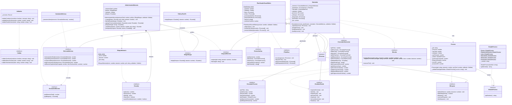

# Diagrama de clases

```mermaid
classDiagram
  direction TB

  class IValidar {
    <<interface>>
    +validarCondicion(condicion: boolean, mensaje: string) void
    +validarEnteroPositivo(valor: number, nombre: string) void
    +validarTextoNoVacio(valor: string, nombre: string) void
  }
  class Validador {
    -_acciones: Record
    +validarCondicion(condicion: boolean, mensaje: string) void
    +validarEnteroPositivo(valor: number, nombre: string) void
    +validarTextoNoVacio(valor: string, nombre: string) void
  }

  class IEstadoProceso {
    <<interface>>
    +getNombre() string
  }
  class EstadoProceso {
    +Nuevo: IEstadoProceso$
    +EsperandoMemoria: IEstadoProceso$
    +Listo: IEstadoProceso$
    +Ejecutando: IEstadoProceso$
    +Bloqueado: IEstadoProceso$
    +Terminado: IEstadoProceso$
    -_nombre: string
    -EstadoProceso(nombre: string)
    +getNombre() string
  }

  class IConsultarProceso {
    <<interface>>
    +getPid() string
    +getMemoria() number
    +getCpuTotal() number
    +getCpuRestante() number
    +getEstado() IEstadoProceso
    +getQuantumConsumido() number
    +getBloqueoRestante() number
  }
  class ICambiarEstado {
    <<interface>>
    +esperarMemoria() void
    +admitir() void
    +asignarCpu() void
    +ejecutarTick() void
    +expulsar() void
    +renovarQuantum() void
    +finalizar() void
  }
  class IBloquear {
    <<interface>>
    +definirES(inicio: number, duracion: number) void
    +debeBloquearse() boolean
    +bloquear() void
    +avanzarBloqueo() void
    +desbloquear() void
  }
  class IProcesar {
    <<interface>>
  }
  class Proceso {
    -_pid: string
    -_memoria: number
    -_cpuTotal: number
    -_validador: IValidar
    -_cpuRestante: number
    -_estado: IEstadoProceso
    -_quantumConsumido: number
    -_bloqueoRestante: number
    -_inicioES: number
    -_duracionES: number
    +Proceso(pid: string, memoria: number, cpuTotal: number, validador: IValidar)
    -_validarEstado(permitidos: IEstadoProceso[], accion: string) void
  }

  class IGuardar {
    <<interface>>
    +getInicio() number
    +getTamanio() number
    +getPid() string
    +estaLibre() boolean
    +puedeGuardar(tamanio: number) boolean
  }
  class BloqueMemoria {
    +Libre: string$
    -_inicio: number
    -_tamanio: number
    -_pid: string
    +BloqueMemoria(inicio: number, tamanio: number, pid: string, validador: IValidar)
  }

  class IElegirBloque {
    <<interface>>
    +elegir(bloques: IGuardar[], tamanio: number) IGuardar[]
  }
  class PoliticaFirstFit {
    +elegir(bloques: IGuardar[], tamanio: number) IGuardar[]
  }

  class IConsultarMemoria {
    <<interface>>
    +getMemoriaTotal() number
    +getBloques() IGuardar[]
  }
  class IAsignarMemoria {
    <<interface>>
    +asignar(pid: string, tamanio: number) boolean
    +liberar(pid: string) void
  }
  class AdministradorMemoria {
    -_memoriaTotal: number
    -_politica: IElegirBloque
    -_validador: IValidar
    -_bloques: IGuardar[]
    +AdministradorMemoria(memoriaTotal: number, politica: IElegirBloque, validador: IValidar)
    -_ocupar(bloque: IGuardar, pid: string, tamanio: number) void
    -_liberarBloque(bloque: IGuardar) void
    -_agregarFusionando(resultado: IGuardar[], actual: IGuardar) IGuardar[]
    -_bloquesDe(pid: string) IGuardar[]
    -_crearBloque(inicio: number, tamanio: number, pid: string) IGuardar
    -_reemplazar(original: IGuardar, nuevos: IGuardar[]) void
  }

  class IConsultarCpu {
    <<interface>>
    +getQuantum() number
    +getListos() IConsultarProceso[]
    +getEnCpu() IConsultarProceso[]
    +getCambiosContexto() number
    +getHistorial() string[]
  }
  class IPlanificar {
    <<interface>>
    +encolar(proceso: IProcesar) void
    +ejecutarTick() void
    +getTerminadosDelTick() IProcesar[]
    +getBloqueadosDelTick() IProcesar[]
  }
  class PlanificadorRoundRobin {
    +CpuOciosa: string$
    -_quantum: number
    -_validador: IValidar
    -_listos: IProcesar[]
    -_enCpu: IProcesar[]
    -_terminadosDelTick: IProcesar[]
    -_bloqueadosDelTick: IProcesar[]
    -_historial: string[]
    -_cambiosContexto: number
    +PlanificadorRoundRobin(quantum: number, validador: IValidar)
    -_asignarCpu() void
    -_anotarHistorial(ejecutados: IProcesar[]) void
    -_resolverSalidas(ejecutados: IProcesar[]) void
  }

  class ICalcularMetricas {
    <<interface>>
    +memoriaLibreTotal(memoria: IConsultarMemoria) number
    +mayorBloqueLibre(memoria: IConsultarMemoria) number
    +ocupacionMemoria(memoria: IConsultarMemoria) number
    +fragmentacionExterna(memoria: IConsultarMemoria) number
    +utilizacionCpu(ticksCpuOcupada: number, ticksTranscurridos: number) number
  }
  class CalculadorMetricas {
    -_tamaniosLibres(memoria: IConsultarMemoria) number[]
  }

  class IConsultarSimulacion {
    <<interface>>
    +getTick() number
    +getProcesos() IConsultarProceso[]
    +getEnCpu() IConsultarProceso[]
    +getListos() IConsultarProceso[]
    +getEnEspera() IConsultarProceso[]
    +getBloqueados() IConsultarProceso[]
    +getTerminados() IConsultarProceso[]
    +getMapaMemoria() IGuardar[]
    +getHistorialCpu() string[]
    +getOcupacionMemoria() number
    +getUtilizacionCpu() number
    +getCambiosContexto() number
    +getMemoriaLibreTotal() number
    +getMayorBloqueLibre() number
    +getFragmentacionExterna() number
  }
  class ISimular {
    <<interface>>
    +registrarProceso(pid: string, memoria: number, cpuTotal: number) void
    +registrarProcesoConES(pid: string, memoria: number, cpuTotal: number, inicio: number, duracion: number) void
    +avanzarTick() void
  }
  class Simulador {
    -_memoria: IConsultarMemoria y IAsignarMemoria
    -_planificador: IConsultarCpu y IPlanificar
    -_calculador: ICalcularMetricas
    -_validador: IValidar
    -_procesos: IProcesar[]
    -_enEspera: IProcesar[]
    -_bloqueados: IProcesar[]
    -_terminados: IProcesar[]
    -_tick: number
    +Simulador(memoria, planificador, calculador: ICalcularMetricas, validador: IValidar)
    -_registrar(proceso: IProcesar) void
    -_faseAdmision() void
    -_faseBloqueados() void
    -_faseEjecucion() void
  }

  %% Realización: cada clase implementa sus interfaces
  Validador ..|> IValidar
  EstadoProceso ..|> IEstadoProceso
  Proceso ..|> IConsultarProceso
  Proceso ..|> ICambiarEstado
  Proceso ..|> IBloquear
  BloqueMemoria ..|> IGuardar
  PoliticaFirstFit ..|> IElegirBloque
  AdministradorMemoria ..|> IConsultarMemoria
  AdministradorMemoria ..|> IAsignarMemoria
  PlanificadorRoundRobin ..|> IConsultarCpu
  PlanificadorRoundRobin ..|> IPlanificar
  CalculadorMetricas ..|> ICalcularMetricas
  Simulador ..|> IConsultarSimulacion
  Simulador ..|> ISimular

  %% Herencia entre interfaces
  IProcesar --|> IConsultarProceso
  IProcesar --|> ICambiarEstado
  IProcesar --|> IBloquear

  %% Composición y agregación
  AdministradorMemoria "1" *-- "1..*" IGuardar : bloques
  AdministradorMemoria "1" o-- "1" IElegirBloque : política
  Simulador "1" o-- "1" IAsignarMemoria : memoria
  Simulador "1" o-- "1" IPlanificar : planificador
  Simulador "1" o-- "1" ICalcularMetricas : calculador
  Simulador "1" o-- "0..*" IProcesar : procesos
  PlanificadorRoundRobin "1" o-- "0..*" IProcesar : listos
  PlanificadorRoundRobin "1" o-- "0..1" IProcesar : en CPU
  Proceso "0..*" --> "1" IEstadoProceso : estado

  %% Dependencias (usa o crea)
  Simulador ..> Proceso : crea
  AdministradorMemoria ..> BloqueMemoria : crea
  ICalcularMetricas ..> IConsultarMemoria : consulta
```